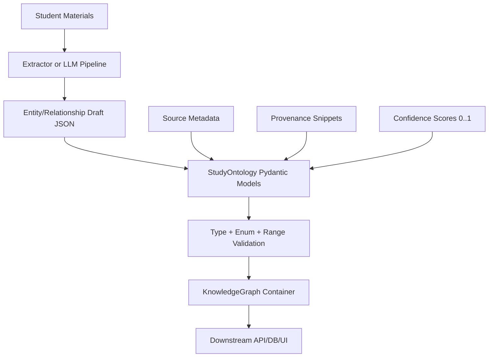

# StudyOntology

StudyOntology is a typed ontology package for student-learning knowledge graphs. It gives downstream apps a shared schema and Pydantic models for concepts, theories, methods, assignments, source documents, and confidence-scored relationships.

This README is intentionally hackathon-first and downstream-integration-first.

## Why This Project Fits the Hackathon

- Student scenario: teams can turn class content into structured graph data with consistent types.
- Meaningful AI support: extraction systems can write into one validated graph contract instead of ad hoc JSON.
- Demo-ready: simple create-validate-serialize flow that plugs into APIs and UIs quickly.
- Suggested guiding category: **Studying**.

## Demo Story (5 Minutes)

1. Show raw extracted entities/relationships from your pipeline (or mock payload).
2. Load them into `StudyOntology` models and validate fields/enums.
3. Build a `KnowledgeGraph` object and serialize output for your API/database.
4. Show a confidence-filtered relationship view in your app.
5. Close with responsible AI notes (schema constraints, provenance, and limits).

## Team Roles (Suggested Ownership)

- Tech Lead: model integration, validation flow, and downstream contract stability.
- Product Lead: student workflow framing and demo narrative.
- Ethics Lead: provenance, confidence messaging, and failure-path transparency.

## Architecture At a Glance



## Tech Stack

- Python 3.13+
- Pydantic models generated from LinkML schema
- Nix for reproducible development/build

## Run Locally

### 1) Enter the dev shell

```bash
nix develop
```

### 2) Build the package

```bash
nix build
```

### 3) Validate code quality

```bash
flake8 lib/
pyright lib/
```

## Quick Start (Downstream Usage)

```python
from StudyOntology.lib import (
    Concept,
    DifficultyLevel,
    KnowledgeGraph,
    KnowledgeRelationship,
    RelationshipType,
)

linear_algebra = Concept(
    id="concept:linear_algebra",
    name="Linear Algebra",
    difficulty_level=DifficultyLevel.INTERMEDIATE,
    domain="Mathematics",
)

svd = Concept(
    id="concept:svd",
    name="Singular Value Decomposition",
    difficulty_level=DifficultyLevel.ADVANCED,
    domain="Mathematics",
)

rel = KnowledgeRelationship(
    subject="concept:linear_algebra",
    predicate=RelationshipType.PREREQUISITE_OF,
    object="concept:svd",
    confidence=0.93,
)

graph = KnowledgeGraph(concepts=[linear_algebra, svd], relationships=[rel])
```

## Package Conventions

- This repository is a **schema/models package**, not a FastAPI service.
- Primary schema source: `schema.yaml`.
- Generated Pydantic module: `lib/StudyOntology/lib.py`.
- License in schema metadata: Apache 2.0.

## Entity and Enum Index

Core entities:

- `Concept`
- `Theory`
- `Person`
- `Method`
- `Assignment`
- `SourceDocument`
- `KnowledgeRelationship`
- `ExtractionProvenance`
- `ExtractionResult`
- `KnowledgeGraph`

Enums:

- `RelationshipType`: `PREREQUISITE_OF`, `EXAMPLE_OF`, `CONTRASTS_WITH`, `LOCATED_IN`, `PRODUCES`, `CONSUMES`, `APPLIES_TO`, `ASSESSED_BY`, `COVERS`
- `DifficultyLevel`: `INTRODUCTORY`, `INTERMEDIATE`, `ADVANCED`, `EXPERT`
- `DocumentOrigin`: `USER_UPLOAD`, `CANVAS_API`, `WEB_SCRAPE`, `MANUAL_ENTRY`
- `AssignmentType`: `HOMEWORK`, `QUIZ`, `EXAM`, `PROJECT`, `DISCUSSION`, `LAB`, `ESSAY`, `OTHER`

## Data Model Notes (For Integrators)

- `KnowledgeRelationship.confidence` is constrained to `0.0..1.0`.
- `SourceDocument.origin` is required and standardized via `DocumentOrigin`.
- Provenance is modeled explicitly with `ExtractionProvenance` to support auditability.
- `KnowledgeGraph` is the root container for graph exchange between services.

## Responsible AI + Risk Mitigations

- Validation discipline: strict typed models reduce malformed graph payloads.
- Provenance support: source and extraction metadata can be attached to entities/relationships.
- Confidence transparency: relationship confidence is explicit and bounded.
- Known limitation: schema validation does not guarantee factual correctness of extracted content.

## What Judges Can Verify Quickly

- **Technical Impressiveness (50%)**: typed ontology + relationship constraints + graph container usable downstream.
- **Impact (20%)**: enables student-focused study tooling to share one consistent knowledge contract.
- **Product Thinking (10%)**: clear flow from extraction outputs to app-ready structured graph data.
- **Use of AI to Build (10%)**: package provides stable target schema for AI extraction pipelines.
- **Ethics / Responsible Use (10%)**: explicit provenance fields, confidence bounds, and transparent limitations.

## Useful Commands

```bash
# Enter dev environment
nix develop

# Build package
nix build

# Lint + typecheck
flake8 lib/
pyright lib/
```

## Project Structure

```text
lib/StudyOntology/
  __init__.py                 # Package entry
  lib.py                      # Generated Pydantic models
schema.yaml                   # LinkML schema source
pyproject.toml                # setuptools package config
flake.nix                     # Nix flake entry
nix/
  shell.nix                   # Dev shell
  overlay.nix                 # Nix package overlay
```

## Current Scope Limitations

- No dedicated API server in this repository (intended for downstream integration).
- No first-class CLI workflow is defined yet.
- Automated test suite is not yet configured.
